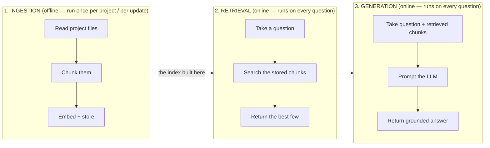
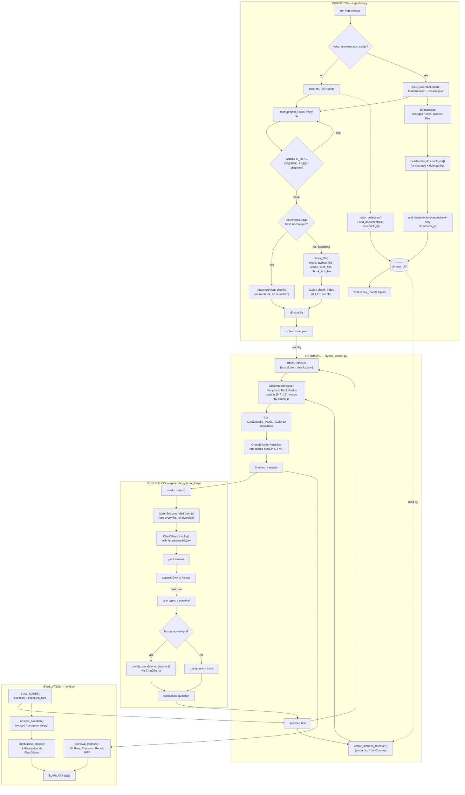

# codebase-rag — How This Works

*Written so that a future version of you, returning with zero memory of building this,
can understand what it does, where each piece lives, how it works, and why it was built
that way.*

## Table of contents

1. [What this project is](#1-what-this-project-is)
2. [Glossary](#2-glossary-terms-used-throughout)
3. [The three-phase mental model](#3-the-three-phase-mental-model)
4. [How to actually run it](#4-how-to-actually-run-it)
5. [Deep dive: Chunking](#5-deep-dive-chunking)
6. [Deep dive: Ingestion](#6-deep-dive-ingestion)
7. [Deep dive: Storage](#7-deep-dive-storage)
8. [Deep dive: Retrieval](#8-deep-dive-retrieval)
9. [Deep dive: Generation](#9-deep-dive-generation)
10. [Deep dive: Evaluation](#10-deep-dive-evaluation)
11. [Cross-cutting concepts](#11-cross-cutting-concepts)
12. [Tech stack](#12-tech-stack--why-each-piece-is-there)
13. [Bugs found and fixed (worth remembering)](#13-bugs-found-and-fixed-worth-remembering)
14. [What's NOT built yet](#14-whats-not-built-yet)

---

## 1. What this project is

A tool that lets you ask natural-language questions about a codebase — "where is
`register_user` implemented?", "what does the login flow do?" — and get an answer
grounded in the actual code, with file names and line numbers cited.

It runs **entirely locally**. No API keys, no data leaving your machine:
- **Ollama** runs the embedding model and the chat model, both locally.
- **Chroma** is a local, file-backed vector database (just a folder on disk: `chroma_db/`).

There are three things you *do* with it:
- **`ingestion.py`** — point it at a project directory once (or whenever the code
  changes), and it reads that project into a searchable index. Safe to re-run any time —
  it only re-processes what actually changed.
- **`generate.py`** — an interactive terminal loop where you ask questions about
  whatever project was last ingested.
- **`eval.py`** — runs a fixed set of test questions against the current index and
  reports retrieval/answer-quality metrics, so a pipeline change can be judged
  objectively instead of by eyeballing one query.

## 2. Glossary (terms used throughout)

If any of this project's vocabulary has gone rusty, start here.

- **RAG (Retrieval-Augmented Generation)** — instead of asking an LLM a question cold
  (where it can only answer from what it memorized during training), you first *retrieve*
  relevant material from your own data, then hand that material to the LLM alongside the
  question, so it answers from your actual content instead of guessing.
- **Chunk** — a bite-sized piece of a file (one function, one class, one paragraph). LLMs
  and vector databases work on chunks, not whole files, because whole files are too large
  and too unfocused to search or feed into a prompt efficiently.
- **Embedding** — a chunk of text converted into a list of numbers (a vector) such that
  texts with similar *meaning* end up as similar vectors. This is what makes "semantic"
  search possible — you can find text that means the same thing even if it uses different
  words.
- **Vector database** — a database (Chroma, here) specialized in storing embeddings and
  quickly finding "which stored vectors are closest to this query vector."
- **AST (Abstract Syntax Tree)** — the actual parsed structure of source code (this is a
  function, this is a class, this is an import), as opposed to just treating code as a
  flat string of characters. Parsing code as an AST lets you chunk at real boundaries
  (whole functions) instead of arbitrary character counts (which can cut a function in
  half).
- **BM25** — a decades-old, still very effective algorithm for *lexical* (keyword-based)
  search — it scores documents by how well their exact words match the query's words,
  weighted by how rare/informative those words are. This is the "keyword search" half of
  this project's hybrid search.
- **Hybrid search** — combining lexical search (BM25 — good at exact terms, identifiers,
  file paths) with semantic search (embeddings — good at paraphrases, concepts) so each
  covers the other's blind spot.
- **Reciprocal Rank Fusion (RRF)** — the specific math used to combine two different
  ranked lists (BM25's ranking and the vector search's ranking) into one final ranking,
  based on each item's *position* in each list rather than trying to compare
  incomparable raw scores (a BM25 score and a cosine distance aren't on the same scale).
- **Cross-encoder / reranking** — a second, more expensive but more accurate model that
  takes the query and a candidate chunk *together* and directly scores how relevant that
  chunk actually is. Hybrid search is used first to cheaply narrow thousands of chunks
  down to a handful of candidates; the cross-encoder then re-scores just that handful
  properly.
- **Grounding** — instructing the LLM to answer *only* using the retrieved context, and
  not from what it happens to remember from training, to reduce made-up answers.
- **Idempotent** — running an operation once, or a hundred times, leaves the system in
  the same end state. Ingestion is designed to be idempotent.
- **Manifest** — a small record of "what did we index last time, and what did it look
  like" (here: a file-path → content-hash map), used to detect what's actually changed
  since the last run.

## 3. The three-phase mental model

Everything in this project is one of three things. Confusing which phase something
belongs to is the easiest way to misunderstand this codebase, so get this straight first:



### 3.1 — The complete flow, in full detail

The diagram above is the mental model. This is what actually happens, file by file —
every branch, every module, all three entry points (`ingestion.py`, `generate.py`,
`eval.py`):



**Ingestion happens once (or whenever code changes).** Retrieval and generation happen
**every single time you ask a question**, always operating on whatever was last ingested.
Retrieval can never be better than the chunks ingestion produced — if a chunk was never
created, or was created badly, no amount of clever searching fixes that.

## 4. How to actually run it

Prerequisites: Ollama installed and running (`ollama serve`, or the desktop app), with
both models pulled:
```bash
ollama pull nomic-embed-text
ollama pull llama3.2
```

**Step 1 — ingest a project** (edit `PROJECT_DIR` in `app/rag/ingestion.py` first, it's
currently hardcoded — see [§14](#14-whats-not-built-yet)):
```bash
uv run app/rag/ingestion.py
```
This reads every file under `PROJECT_DIR`, chunks whatever changed since the last run,
and updates the Chroma index at `chroma_db/`, plus a debug dump at `chunks.json` and a
change-tracking `index_manifest.json`. Safe to run repeatedly — see [§6](#6-deep-dive-ingestion).

**Step 2 — ask questions about it:**
```bash
uv run app/rag/generate.py
```
Drops you into a `Question:` loop. Type `exit` or `quit` to leave. Follow-up questions
work — you don't need to re-state context each time (see [§9](#9-deep-dive-generation)).

**Step 3 (optional) — measure retrieval/answer quality:**
```bash
uv run app/rag/eval.py
```
Runs a fixed set of test questions and prints metrics — see [§10](#10-deep-dive-evaluation).

## 5. Deep dive: Chunking

**What**: splitting a file into meaningful, retrievable pieces before anything gets
embedded or indexed.

**Why it matters more than it sounds**: this is the single biggest lever on answer
quality in the whole project. A perfect retriever searching over badly-chunked data
(half a function, or a whole 500-line file as one blob) will still return bad results,
because there was never a good "unit" to find in the first place.

**Where**: `app/rag/chunking_strategy/`

| File | What it does |
|---|---|
| `scan_project.py` | Walks the whole project directory tree; decides what to skip; dispatches each remaining file to the right chunker below; drives both full and incremental scans (see [§6](#6-deep-dive-ingestion)). |
| `file_support.py` | Maps a file's extension to a `file_type` string (`"python"`, `"javascript"`, `"config"`, etc.) that `scan_project.py` uses to pick a chunker. Also defines the ignore lists. |
| `chunk_python_file.py` | Chunks `.py` files. |
| `chunk_js_ts_file.py` | Chunks `.js`/`.jsx`/`.ts`/`.tsx` files. |
| `text_chunker.py` | Fallback for everything else (HTML/CSS/JSON/YAML/TOML/Markdown/plain text). |
| `chunk_documents.py` | Converts the raw chunk dicts produced above into the `Document` objects the rest of the pipeline (storage, retrieval) actually consumes. Covered in [§7](#7-deep-dive-storage) since it's really the ingestion→storage bridge. |
| `manifest.py` | Content-hashing and manifest load/save, used to detect which files actually changed between ingestion runs. Covered in [§6](#6-deep-dive-ingestion). |

### 5.1 — Deciding what to skip (`scan_project.py`)

**How**: two layers of filtering happen before a file is even looked at:
1. `IGNORED_DIRS` (in `file_support.py`) — a hardcoded list: `.git`, `.venv`, `venv`,
   `__pycache__`, `node_modules`, `dist`, `build`, `coverage`, `chroma_db`. Any file whose
   path contains one of these as a directory component is skipped outright.
2. **Every `.gitignore` found anywhere in the project tree** — not just one at the
   project root. `load_gitignore_specs()` walks the whole tree with
   `project_dir.rglob(".gitignore")`, parses each one found (using the `pathspec` library,
   which implements real git wildcard-matching semantics, not a hand-rolled
   approximation), and remembers which directory each one belongs to (since gitignore
   patterns are relative to the `.gitignore`'s own location, not the project root).
   `should_ignore()` then checks a candidate file against every `.gitignore` whose
   directory is an ancestor of that file.

**Why**: the project's own ignore rules are the ground truth for "stuff nobody wants
tracked" — which very much includes secrets (`.env`-adjacent files, local config with
credentials). Only trusting our own hardcoded list means a project-specific secret file
we didn't happen to think of gets scanned, chunked, embedded, and dumped in plaintext
into `chunks.json`. Respecting *every* `.gitignore` in the tree (not just the root one)
matters concretely — this project's own test fixture (`ExpenseTracker`) has its
`.gitignore` nested inside `Frontend/ExpenseTracker-project/`, not at the repo root.

Beyond directory-level and gitignore-level filtering, `file_support.py` also has
`IGNORED_FILES` — specific filenames always skipped regardless of extension: lockfiles
(`package-lock.json`, `uv.lock`, `yarn.lock`, `Cargo.lock`, etc.). These are
machine-generated dependency listings, not source code — indexing them pollutes the
vector store with page after page of `"@babel/generator": "^7.26.9"`-style noise that
can outrank genuinely relevant source code for any query that happens to mention
"library"/"dependency"/"package".

### 5.2 — Python chunking (`chunk_python_file.py`)

**How**: parses the file with Python's built-in `ast` module (a real parser, not regex),
then walks `tree.body` (the file's **top-level** statements only — deliberately not
recursing into nested/inner functions) and produces one chunk per:
- Each top-level `FunctionDef`/`AsyncFunctionDef` → `type: "function"`
- Each top-level `ClassDef` → `type: "class"`, plus one more chunk per method inside it
  → `type: "method"`, with `class` set to the class's name
- **All top-level `import`/`from...import` statements, grouped into one single chunk**
  → `type: "imports"`

Each chunk carries: `code` (the exact source text), `file`, `type`, `name`, `class`,
`start_line`, `end_line`. A `chunk_index` (this chunk's position within *its own file*,
starting at 0) is assigned afterward, centrally, by `scan_project.py` — see [§6](#6-deep-dive-ingestion).

**Why group imports into one chunk instead of ignoring them or chunking them
individually**: originally imports weren't chunked *at all* (the walker only matched
`FunctionDef`/`ClassDef`), so a question like "what does this file import" had literally
nothing to retrieve — not a bad answer, a *zero* answer, silently. One chunk per file
(rather than one per import line) also makes more retrieval sense: a single import line
in isolation ("`import os`") barely carries any distinguishing meaning, but "here are all
8 things this file imports" is a coherent, searchable unit.

**Why top-level only, not nested functions**: keeps chunk granularity consistent and
predictable — every chunk is something you'd actually want to jump to and read on its
own. A function defined inside another function is really part of its parent's
implementation detail, not an independently meaningful unit.

### 5.3 — JS/TS chunking (`chunk_js_ts_file.py`)

**How**: same idea as the Python chunker, but Python's own file can't parse JavaScript,
so this uses **tree-sitter** (via the `tree-sitter-language-pack` package) — a real
parser generator that produces an AST for many languages. The grammar is picked per file
extension: `.js`/`.jsx` → `javascript` grammar, `.ts` → `typescript`, `.tsx` → `tsx`
(the JSX-aware TypeScript grammar).

It walks the top-level nodes of the parsed tree and produces a chunk for:
- `function_declaration` → `type: "function"`
- `class_declaration` → `type: "class"`, plus one chunk per `method_definition` inside its
  `class_body` → `type: "method"`
- A `const`/`let` assigned to an arrow function or function expression (e.g.
  `const foo = () => {...}`) → also `type: "function"` — this is the idiomatic modern-JS
  way to define a function, and it doesn't use the `function` keyword at all, so it needs
  its own detection path separate from `function_declaration`.
- All top-level `import_statement` nodes, grouped into one `type: "imports"` chunk (same
  rationale as Python).

It also **unwraps `export` and `export default`**: `export function foo(){}` and
`export default class Foo{}` both get their inner declaration node found and chunked
normally (tree-sitter puts the actual `function_declaration`/`class_declaration` as a
child of an `export_statement` wrapper node, accessible via
`node.child_by_field_name("declaration")`), including the edge case of an anonymous
default export (`export default () => {}`, which uses field `value` instead of
`declaration`).

**Why JS needs meaningfully more branching than Python did**: JavaScript has roughly four
different ways to define something that's "a function" (declaration, arrow-const,
function expression, class method) where Python effectively has one
(`def`/`async def`). Each of those needed its own node-type check.

### 5.4 — Everything else (`text_chunker.py`)

**How**: a generic `RecursiveCharacterTextSplitter` (from `langchain-text-splitters`) —
splits by character count (`chunk_size=1000`, `chunk_overlap=200`), preferring to break
at paragraph breaks, then line breaks, then spaces, before resorting to a hard
mid-word cut.

**Why this is fine here but wasn't fine for code**: for prose/config (Markdown, JSON,
YAML, TOML, HTML/CSS), there's no equivalent of "a function" to preserve — a generic
splitter is a reasonable, low-effort default. It would *not* be fine for source code,
which is exactly why Python and JS/TS got dedicated AST-based chunkers instead of being
left on this path — a character splitter has no idea where a function begins or ends and
will cut one in half as readily as anywhere else.

## 6. Deep dive: Ingestion

**What**: the process that turns a project directory into a searchable index, and keeps
it in sync as the project changes — **without** re-embedding the entire project every
single time.

**Where**: `app/rag/ingestion.py` (the orchestrator), `chunking_strategy/scan_project.py`
(the scan itself), `chunking_strategy/manifest.py` (change detection).

### 6.1 — Bootstrap vs. incremental

Every run starts by checking whether `index_manifest.json` exists:

- **No manifest found → bootstrap run.** Nothing to diff against, so the whole project
  is scanned and chunked from scratch, `vector_store.reset_collection()` wipes the Chroma
  collection first, and everything gets added fresh. This also doubles as a **migration
  path**: an index built before incremental indexing existed used a different, unstable
  chunk-ID scheme (see [§13](#13-bugs-found-and-fixed-worth-remembering), bug #10) — the
  first bootstrap run after that scheme changed automatically replaces it with a correct
  one, with no manual cleanup needed.
- **Manifest found → incremental run.** Only files that actually changed get re-chunked
  and re-embedded; everything else is left alone.

### 6.2 — How incremental detection works

**How**: `scan_project()` (in `scan_project.py`) takes an optional `previous_manifest`
(`{file_path: content_hash}`, SHA-256) and `previous_chunks_by_file`. For every file it
encounters during its walk:
- Hash the file's current content.
- If that hash matches what's in `previous_manifest` → **skip re-chunking entirely**,
  reuse the chunks already recorded for that file from `previous_chunks_by_file`.
- Otherwise (new file, or hash differs) → **re-chunk it** via the normal dispatch
  ([§5](#5-deep-dive-chunking)), and assign each of its chunks a `chunk_index` (0, 1, 2...
  — its position *within that file's own chunk list*, not a global position — see
  [§7](#7-deep-dive-storage) for why this distinction matters).

After the walk, any file present in `previous_manifest` but never encountered this time
is reported as **deleted**.

`scan_project()` returns `(all_chunks, manifest, deleted_files)` — `all_chunks` is
*every* currently-valid chunk (reused + freshly chunked), `manifest` is this run's fresh
`{file: hash}` map, and it's `ingestion.py`'s job to figure out what to actually do about
Chroma with that information.

### 6.3 — Updating Chroma without a full rebuild

**How** (`ingestion.py`, incremental branch): compare the new `manifest` against
`previous_manifest` to get `changed_or_new_files`. Union that with `deleted_files` to get
every file whose *old* chunks are now stale. For each of those files, look up its old
chunks (from `previous_chunks_by_file`) and compute their `chunk_id`s
(`f"{file}:{chunk_index}"`) — those get passed to `vector_store.delete(ids=...)`. Then
the freshly (re)chunked chunks (only from `changed_or_new_files`, since unchanged files'
embeddings are still correct and untouched) get converted to `Document`s and added via
`vector_store.add_documents(documents, ids=[...])`.

**Why `ids=` has to be passed explicitly — this was a real bug found while building
this**: `Chroma.add_documents()` auto-generates a random UUID for every document unless
you hand it explicit IDs. Deleting later by our own `chunk_id` strings silently deletes
*nothing*, because Chroma's real internal IDs were never our `chunk_id`s at all — they
were random UUIDs the whole time. This had been invisible until now because the old
full-rebuild strategy never needed to delete anything by ID — it just wiped the whole
collection. The instant "delete this file's old chunks, keep everything else" was
required, the gap became a real, load-bearing bug rather than a harmless inconsistency.
Fixed by passing `ids=[doc.metadata["chunk_id"] for doc in documents]` on every
`add_documents()` call, so Chroma's real ID and our `chunk_id` are now the same string.

### 6.4 — What gets written every run

1. `chunks.json` — the *complete* current chunk list (reused + fresh), same as before.
2. `index_manifest.json` — this run's `{file: hash}` map, for next time's diff.

**Why incremental indexing needed the `chunk_index` fix first**: before this feature,
`chunk_id` was computed as `f"{file}:{global list position}"` — global across *every*
file combined, not scoped to one file. That's harmless under a full-rebuild-only
strategy (everything's always recomputed together, so global consistency holds), but it
breaks incremental indexing outright: if file A's chunk count changes, every later file's
IDs would silently shift, making "delete just this file's old chunks" impossible to do
correctly. Fixing `chunk_id` to be per-file-stable (`chunk_index` reset to 0 for each
file, assigned once in `scan_project.py`, reused everywhere) was a prerequisite, done as
part of this change — see `chunk_documents.py`, [§7](#7-deep-dive-storage).

## 7. Deep dive: Storage

**What**: where the embeddings actually live, and the shared configuration all other
modules pull from so there's exactly one definition of "the vector store" in the whole
project.

**Where**: `app/rag/store.py`

**How**: defined once:
- `PROJECT_ROOT`, `CHROMA_DIR`, `CHUNKS_FILE`, `MANIFEST_FILE` — computed via
  `Path(__file__).resolve().parents[2]`, i.e. anchored to *this file's own location on
  disk*, not to whatever directory the script happens to be run from (`cwd`).
- `embeddings` — an `OllamaEmbeddings(model="nomic-embed-text")` instance.
- `vector_store` — a `Chroma` instance (collection name `"codebase"`), pointed at
  `CHROMA_DIR`.

Every other module that needs the vector store (`ingestion.py`, `hybrid_search.py`)
imports `vector_store` from here rather than constructing its own — there used to be
**four separate copies** of this same setup scattered across the codebase before this
was consolidated.

**Why path-anchoring via `Path(__file__)` instead of a relative string like
`"./chroma_db"`**: a relative path is relative to whatever directory you happen to `cd`
into before running a script. This bit us for real early on — `ingestion.py` writes
`chunks.json` with a relative path, and `hybrid_search.py` tried to read `chunks.json`
with the *same* relative path, but the two scripts were being run from different working
directories, so one wrote the file somewhere the other never looked. Anchoring to the
file's own on-disk location makes both always agree, regardless of where you run the
script from.

**Also inside the chunking→storage seam** (`chunking_strategy/chunk_documents.py`,
called from `ingestion.py`, `hybrid_search.py`, and `eval.py`):
- Computes a **stable `chunk_id`**: `f"{chunk['file']}:{chunk_index}"`, where
  `chunk_index` is the chunk's position *within its own file's chunk list* (assigned once
  in `scan_project.py`, carried through `chunks.json`) — **not** its position in
  whatever larger list happens to be passed to `chunks_to_documents()` at the time. This
  distinction is what makes the ID stable across incremental re-indexing (§6.4) — a
  chunk's ID never changes just because some *other*, unrelated file gained or lost a
  chunk. This one string is what lets a chunk produced by ingestion, a chunk found by the
  BM25 retriever, and a chunk found by the vector retriever all be recognized as "the
  same chunk" later during retrieval merging — see [§8](#8-deep-dive-retrieval) and the
  bug notes in [§13](#13-bugs-found-and-fixed-worth-remembering).
- Prefixes the text that actually gets embedded with `File: {path}\n\n` before the
  code — so the *embedding itself* (not just metadata sitting alongside it) is aware of
  which file/directory a chunk came from. This is what makes a query like "what do we
  import in **backend** files" actually favor backend files semantically, not just
  lexically — see [§11](#11-cross-cutting-concepts).

## 8. Deep dive: Retrieval

**What**: given a question, find the handful of chunks (out of everything ingested) most
likely to help answer it.

**Where**: `app/rag/searching_strategy/hybrid_search.py`

**How**, in two stages:

**Stage 1 — cast a wide net cheaply**, via `EnsembleRetriever` combining two independent
retrievers:
- `BM25Retriever` — lexical (keyword) search, built from the exact same `chunks.json`
  that ingestion produced (loaded and passed through `chunks_to_documents` again, so its
  `Document`s and `chunk_id`s are identical to what's in Chroma).
- `vector_store.as_retriever()` — semantic (embedding-based) search over Chroma.

These two ranked lists get merged via **reciprocal rank fusion**, weighted
`[0.7, 0.3]` in favor of the vector retriever, and merged **by `chunk_id`**
(`id_key="chunk_id"` — passed explicitly rather than relying on `EnsembleRetriever`'s
default of matching by exact `page_content` string, which is more fragile). This stage
pulls `CANDIDATE_POOL_SIZE = 10` candidates — deliberately more than the final answer
needs.

**Stage 2 — rerank that pool for real relevance**, via `ContextualCompressionRetriever`
wrapping a `CrossEncoderReranker` (backed by the `cross-encoder/ms-marco-MiniLM-L-6-v2`
model, loaded once at module level via `HuggingFaceCrossEncoder` since loading it is
comparatively expensive). This model reads the actual question text *together with* each
of the 10 candidates and scores true relevance directly, then keeps only the top `top_k`
(3, by default).

**Why two stages instead of just one**: BM25 and vector similarity are both *cheap
proxies* for "is this relevant" — word overlap, or embedding distance. Neither actually
reads the question and the candidate together and reasons about relevance. A
cross-encoder does exactly that, but it's too slow to run against *every* chunk in the
whole project on every question — so stage 1 cheaply narrows thousands of chunks down to
10 plausible candidates, and stage 2 spends its expensive, accurate scoring only on
those 10.

**Why hybrid (BM25 + vector) instead of just one retriever**: semantic-only search
misses exact identifier/keyword matches (searching for a specific function name might not
be the closest *semantic* match to anything); keyword-only search misses paraphrased
questions that don't share the code's exact vocabulary. Each covers the other's blind
spot.

**A real, known gap this surfaced** (found via the eval harness, [§10](#10-deep-dive-evaluation)):
a query like "what does the login function do?" can retrieve *frontend* `Login.jsx`/
`Login.css`/`App.jsx` instead of the backend `app.py` function that actually implements
login — "login" is semantically and lexically close to those frontend filenames/component
names too, and nothing currently disambiguates "the concept of logging in" from "files
whose name/UI text says Login." Not fixed yet — recorded as a finding, not a fix.

## 9. Deep dive: Generation

**What**: turning (question + retrieved chunks) into an actual grounded, cited answer —
and doing that across a multi-turn conversation, not just one isolated question.

**Where**: `app/rag/generate.py`

**How**: `chat_loop()` (an `input()` loop — `Question: `, type `exit`/`quit` to stop,
guarded behind `if __name__ == "__main__":` so the rest of the module — `answer_question`,
`build_context`, `llm` — can be safely imported elsewhere, e.g. by `eval.py`, without
that loop hijacking the import) that, each turn:

1. **Rewrites the question if there's history** (`rewrite_standalone_question`) — sends
   the conversation so far plus the new (possibly vague) question to `ChatOllama`, asking
   it to produce a standalone version. Skipped entirely on the very first question
   (nothing to rewrite against yet).
2. **Retrieves** using that rewritten, standalone version (`hybrid_search`, [§8](#8-deep-dive-retrieval)) —
   *not* the user's raw wording, since a vague follow-up wouldn't retrieve anything
   useful on its own.
3. **Builds a context block** (`build_context`) — formats each retrieved chunk's file,
   name, type, line range, and code into plain text.
4. **Prompts the LLM** with the *original* question (so the answer still addresses
   exactly what the user asked, in their own words) plus the retrieved context, under
   explicit rules: answer only from context, cite the source file for *every* fact used
   (not just one, if multiple files contributed), include function/class name and line
   numbers when available, don't invent information.
5. **Sends the full running `history`** (every prior turn, both user and assistant) along
   with this turn's prompt to `ChatOllama.invoke(...)`, so the model has genuine
   conversational context, not just the current turn in isolation.
6. Appends this turn's question and answer to `history` for the next iteration.

**Why the rewrite step exists at all**: a follow-up like *"what about the login one?"*
has almost no standalone meaning — embedding that raw text and searching with it doesn't
know "login" refers to a function, let alone which one. The rewrite step turns it into
something like *"What does the login function do?"* using the prior turn's context,
**before** that text ever reaches the retriever. Skipping this (and only keeping message
history for the final answer) was considered and rejected — it would leave retrieval
quality broken for the majority of realistic follow-up questions, which is the actual
point of supporting a conversation at all.

**Cost of this design**: every follow-up question now costs **two** LLM calls (rewrite +
answer) instead of one — a real latency tradeoff, accepted because a fast wrong retrieval
is worse than a slower correct one.

## 10. Deep dive: Evaluation

**What**: objectively measuring retrieval and answer quality against a fixed test set,
instead of eyeballing one or two manually-typed queries (which is how every prior change
in this project was validated, including the BM25/reranking swap — that approach can
show something improved on the one example you tried, but can never show it didn't
regress something else, and can't be re-run automatically).

**Where**: `app/rag/eval.py`

**How**: `EVAL_CASES` is a fixed list of `{question, expected_files}` pairs against the
currently-ingested project (`expected_files` are path *substrings*, e.g. `"Backend/app.py"`,
matched against each retrieved chunk's absolute path — kept as substrings rather than
exact paths so the eval set stays portable across machines/checkouts). For each case:

- **Retrieval metrics** — run `hybrid_search()` directly and compare the retrieved files
  against `expected_files`:
  - **Hit Rate** — did *any* expected file appear anywhere in the top-k? (0 or 1)
  - **Precision** — of the top-k retrieved, what fraction were actually relevant?
  - **Recall** — of all the expected files, what fraction were found in the top-k?
  - **MRR (Mean Reciprocal Rank)** — `1 / rank of the first relevant result` (0 if none
    found) — rewards the correct chunk appearing *early*, not just present somewhere.
- **Faithfulness (LLM-as-judge)** — runs the real `answer_question([], question, top_k)`
  from `generate.py` (empty history — eval questions are one-shot, not conversational),
  then makes a *separate* LLM call: "is every claim in this answer supported by this
  context — yes/no, and which claims aren't." This is a genuinely different use of the
  same idea as the not-yet-built hallucination guardrail ([§14](#14-whats-not-built-yet)) —
  here it's an *offline scoring signal*, there it would be a *runtime* check; the
  mechanism is reusable for both.

Prints per-question results plus a final summary table (Hit Rate/Precision/Recall/MRR/
Faithfulness, averaged across all cases).

**A real, known limitation this surfaced**: the faithfulness judge itself is not fully
reliable at this model scale. In one run, it flagged an answer as unfaithful because
"the context doesn't contain the word 'autoincrement'" — when the underlying code chunk
genuinely did contain that exact text. `llama3.2` acting as its own judge can misread the
very context it's given, which means a low faithfulness score from this check should be
treated as a signal worth a human glance, not an automatic verdict.

## 11. Cross-cutting concepts

A few things don't belong to just one phase — they're properties of the system as a
whole.

**Idempotent ingestion** — covered in [§6](#6-deep-dive-ingestion). Re-running ingestion
always converges to the same correct end state, whether nothing changed, one file
changed, or the whole project changed — never an accumulation, and (as of incremental
indexing) never redundant work either.

**Stable chunk identity (`chunk_id`)** — covered in [§7](#7-deep-dive-storage). The same
`file:chunk_index` string (chunk_index scoped to its own file, not global) is used in
`chunks.json`, in Chroma's actual document IDs, and in the BM25 index, so results from
different retrieval paths reliably refer to "the same chunk" when merged, and so a single
file's chunks can be safely deleted/replaced without disturbing any other file's chunks.
This was a real, silent bug before it was fixed — twice, in two different ways:
1. The keyword-search code path originally built its `chunk_id` from `file:name` while
   the semantic path used `file:index` — the two virtually never matched, so keyword hits
   almost never actually reinforced a semantic hit's score, quietly undermining the
   entire point of "hybrid" search without erroring or looking obviously wrong.
2. `chunk_id` was later made consistent between the two paths, but was still computed as
   a *global* list position rather than a *per-file* one — harmless under a
   full-rebuild-only ingestion strategy, but silently wrong the moment incremental
   indexing needed to target "just this one file's chunks" for deletion. Fixed alongside
   incremental indexing, [§6.4](#64--what-gets-written-every-run).

**Path-aware retrieval** — a question mentioning "backend" or "frontend" needs the file's
*location*, not just its code content, to matter to retrieval. Fixed in two places at
once: keyword matching checks the file path in addition to the code
(`hybrid_search.py`), and the embedded text itself is prefixed with the file path
(`chunk_documents.py`, [§7](#7-deep-dive-storage)) so the semantic model has the same
awareness, not just the lexical one.

**Security-aware ingestion** — covered in [§5.1](#51--deciding-what-to-skip-scanprojectpy).
Respecting every `.gitignore` actually present in a project, not just a hand-maintained
guess at what's safe, so locally-excluded secrets never get embedded or written to
`chunks.json` in the first place.

**Consistent tooling** — both the embedding model and the chat model go through
`langchain-ollama` (`OllamaEmbeddings` and `ChatOllama` respectively). Earlier, chat went
through the raw `ollama` Python client while embeddings went through LangChain's wrapper
— two different clients talking to the same local Ollama server for no functional reason.
Consolidated onto one.

## 12. Tech stack — why each piece is there

| Dependency | Role |
|---|---|
| **Ollama** (external, not a pip package) | Runs `nomic-embed-text` (embeddings) and `llama3.2` (chat) locally. |
| `langchain-ollama` | Thin wrapper classes (`OllamaEmbeddings`, `ChatOllama`) around the local Ollama server. |
| `langchain-chroma`, `chromadb` | The vector store itself and its LangChain integration. |
| `langchain-text-splitters` | `RecursiveCharacterTextSplitter`, used for the non-code-file fallback chunker. |
| `langchain-community` | Home of `BM25Retriever` and `HuggingFaceCrossEncoder`. (Note: this package is flagged as being sunset upstream — still the standard way to get these today, but worth knowing it's in a legacy state.) |
| `langchain-classic` | Home of `EnsembleRetriever`, `ContextualCompressionRetriever`, `CrossEncoderReranker` — these moved out of `langchain` core during LangChain's 1.x restructuring. |
| `rank-bm25` | The actual BM25 scoring implementation underneath `BM25Retriever`. |
| `tree-sitter-language-pack` | Prebuilt tree-sitter grammars (JS/TS/TSX/etc.) for AST-based chunking of non-Python code. |
| `pathspec` | Correct `.gitignore`-style pattern matching (real gitwildmatch semantics), used for security-aware ingestion. |
| `sentence-transformers` (pulls in `torch`, `transformers`) | Runs the local cross-encoder reranking model. By far the heaviest dependency in this project — a deliberate tradeoff for real reranking quality over a local-first project's usual "stay light" bias. |

## 13. Bugs found and fixed (worth remembering)

These were each real, silent failures discovered by actually running queries (or, later,
by actually testing the incremental-indexing/eval code paths directly) and noticing
wrong-looking results — not caught by any test at the time it was introduced. Worth
remembering *why* each fix exists, so a future refactor doesn't accidentally reintroduce
them:

1. **Relative import paths broke package structure** — `scan_project.py` used bare
   imports (`from text_chunker import ...`) that only work if run as a top-level script
   from inside its own folder; fixed to relative imports (`from .text_chunker import
   ...`) matching how it's actually imported as a package.
2. **`KeyError` on `start_line`/`end_line`** — text chunks (non-code files) never had
   these keys at all (only AST-based chunks do); `chunk_documents.py` and
   `hybrid_search.py` used strict indexing instead of `.get()`.
3. **`chunks.json` never actually loaded** — the load code in `hybrid_search.py` was
   commented out, so the module-level `chunks` variable used by keyword search didn't
   exist at all.
4. **Duplicate ingestion** — see [§6](#6-deep-dive-ingestion), originally fixed with
   `reset_collection()` (full wipe-and-rebuild); later replaced by real incremental
   add/delete once chunk IDs became stable enough to support it.
5. **`chunk_id` scheme mismatch (semantic vs. keyword path)** — see
   [§11](#11-cross-cutting-concepts), the keyword-search path computed a different
   `chunk_id` format than the semantic path, so hybrid merging silently barely did
   anything.
6. **Import statements never chunked** — see [§5.2](#52--python-chunking-chunkpythonfilepy).
   A "what does this file import" question had zero retrievable content, not a bad
   answer — an *empty* one.
7. **Lockfiles indexed as content** — `package-lock.json` and friends were being chunked
   like regular files, and their dense list of dependency names could outrank real source
   code for any query mentioning "library"/"package".
8. **Retrieval blind to file paths** — a query saying "backend" had zero influence on
   ranking, since neither keyword matching nor the embedded text ever looked at *where* a
   chunk lived, only its code content. Fixed per [§11](#11-cross-cutting-concepts).
9. **No `.gitignore` awareness** — see [§5.1](#51--deciding-what-to-skip-scanprojectpy).
10. **`chunk_id` scheme was global, not per-file** — see
    [§11](#11-cross-cutting-concepts) and [§6.4](#64--what-gets-written-every-run).
    Harmless under full-rebuild-only ingestion, but would have silently broken
    incremental indexing (shifting IDs whenever an unrelated file's chunk count changed)
    had it not been fixed first.
11. **`add_documents()` ignored our `chunk_id` unless told to use it** — see
    [§6.3](#63--updating-chroma-without-a-full-rebuild). Chroma auto-generates random
    UUIDs as real document IDs unless `ids=` is passed explicitly; deleting later by our
    own `chunk_id` strings matched nothing. Invisible under the old full-wipe strategy;
    a real, blocking bug the moment targeted deletes were needed. Caught by writing an
    actual test for the incremental add/delete behavior, not by inspection.

## 14. What's NOT built yet

In rough priority order (highest-impact/highest-risk first):

1. **No CLI** — `PROJECT_DIR` in `ingestion.py` is still a hardcoded path; must be edited
   by hand to index a different project.
2. **Single shared Chroma collection** — there's only ever one collection
   (`"codebase"`); ingesting a second project currently mixes its chunks into the same
   index as the first (and a bootstrap run on that second project would wipe the first
   project's index entirely, via `reset_collection()`). This is the most important
   structural limitation to fix before this tool could handle "index multiple repos."
3. **No local observability/logging** — no persisted record of past queries, what was
   retrieved, or what was answered, for later inspection.
4. **No hallucination/faithfulness guardrail at *answer time*** — `eval.py` ([§10](#10-deep-dive-evaluation))
   added an *offline* faithfulness check, but nothing checks this live, during a real
   `generate.py` session — the prompt *asks* the model to stay grounded, but nothing
   verifies it did, in the moment it matters.
5. **Only Python and JS/TS get real AST-based chunking** — every other language (Go,
   Rust, Java, etc.) would currently fall back to the generic character splitter.
6. **The generation model itself is a real ceiling** — `llama3.2` run locally is a small
   model compared to what a production system would put behind this much retrieval
   engineering. No amount of retrieval-side work fixes weak final-answer reasoning; that
   tradeoff was made deliberately in favor of staying fully local, but it's worth naming
   as a limit, not something the pipeline could ever "solve." It's also the same
   limitation behind the eval harness's faithfulness judge being unreliable ([§10](#10-deep-dive-evaluation)) —
   a small local model judging its own output has the same ceiling as a small local model
   generating that output in the first place.
7. **Known retrieval gap: "login" (concept) vs. `Login.jsx`/`Login.css` (filenames)** —
   found via the eval harness, see [§8](#8-deep-dive-retrieval). Not yet fixed.
