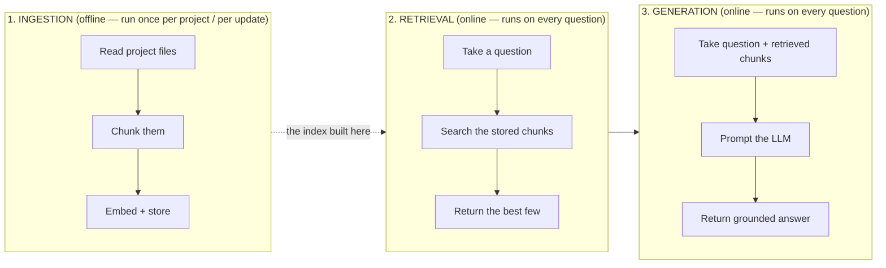

# codebase-rag — How This Works

*Written so that a future version of you, returning with zero memory of building this,
can understand what it does, where each piece lives, how it works, and why it was built
that way.*

## Table of contents

1. [What this project is](#1-what-this-project-is)
2. [Glossary](#2-glossary-terms-used-throughout)
3. [The three-phase mental model](#3-the-three-phase-mental-model)
4. [How to actually run it](#4-how-to-actually-run-it)
5. [Deep dive: Chunking](#5-deep-dive-chunking)
6. [Deep dive: Ingestion](#6-deep-dive-ingestion)
7. [Deep dive: Storage](#7-deep-dive-storage)
8. [Deep dive: Retrieval](#8-deep-dive-retrieval)
9. [Deep dive: Generation](#9-deep-dive-generation)
10. [Cross-cutting concepts](#10-cross-cutting-concepts)
11. [Tech stack](#11-tech-stack--why-each-piece-is-there)
12. [Bugs found and fixed (worth remembering)](#12-bugs-found-and-fixed-worth-remembering)
13. [What's NOT built yet](#13-whats-not-built-yet)

---

## 1. What this project is

A tool that lets you ask natural-language questions about a codebase — "where is
`register_user` implemented?", "what does the login flow do?" — and get an answer
grounded in the actual code, with file names and line numbers cited.

It runs **entirely locally**. No API keys, no data leaving your machine:
- **Ollama** runs the embedding model and the chat model, both locally.
- **Chroma** is a local, file-backed vector database (just a folder on disk: `chroma_db/`).

There are two things you *do* with it:
- **`ingestion.py`** — point it at a project directory once (or whenever the code
  changes), and it reads that project into a searchable index.
- **`generate.py`** — an interactive terminal loop where you ask questions about
  whatever project was last ingested.

## 2. Glossary (terms used throughout)

If any of this project's vocabulary has gone rusty, start here.

- **RAG (Retrieval-Augmented Generation)** — instead of asking an LLM a question cold
  (where it can only answer from what it memorized during training), you first *retrieve*
  relevant material from your own data, then hand that material to the LLM alongside the
  question, so it answers from your actual content instead of guessing.
- **Chunk** — a bite-sized piece of a file (one function, one class, one paragraph). LLMs
  and vector databases work on chunks, not whole files, because whole files are too large
  and too unfocused to search or feed into a prompt efficiently.
- **Embedding** — a chunk of text converted into a list of numbers (a vector) such that
  texts with similar *meaning* end up as similar vectors. This is what makes "semantic"
  search possible — you can find text that means the same thing even if it uses different
  words.
- **Vector database** — a database (Chroma, here) specialized in storing embeddings and
  quickly finding "which stored vectors are closest to this query vector."
- **AST (Abstract Syntax Tree)** — the actual parsed structure of source code (this is a
  function, this is a class, this is an import), as opposed to just treating code as a
  flat string of characters. Parsing code as an AST lets you chunk at real boundaries
  (whole functions) instead of arbitrary character counts (which can cut a function in
  half).
- **BM25** — a decades-old, still very effective algorithm for *lexical* (keyword-based)
  search — it scores documents by how well their exact words match the query's words,
  weighted by how rare/informative those words are. This is the "keyword search" half of
  this project's hybrid search.
- **Hybrid search** — combining lexical search (BM25 — good at exact terms, identifiers,
  file paths) with semantic search (embeddings — good at paraphrases, concepts) so each
  covers the other's blind spot.
- **Reciprocal Rank Fusion (RRF)** — the specific math used to combine two different
  ranked lists (BM25's ranking and the vector search's ranking) into one final ranking,
  based on each item's *position* in each list rather than trying to compare
  incomparable raw scores (a BM25 score and a cosine distance aren't on the same scale).
- **Cross-encoder / reranking** — a second, more expensive but more accurate model that
  takes the query and a candidate chunk *together* and directly scores how relevant that
  chunk actually is. Hybrid search is used first to cheaply narrow thousands of chunks
  down to a handful of candidates; the cross-encoder then re-scores just that handful
  properly.
- **Grounding** — instructing the LLM to answer *only* using the retrieved context, and
  not from what it happens to remember from training, to reduce made-up answers.

## 3. The three-phase mental model

Everything in this project is one of three things. Confusing which phase something
belongs to is the easiest way to misunderstand this codebase, so get this straight first:



**Ingestion happens once (or whenever code changes).** Retrieval and generation happen
**every single time you ask a question**, always operating on whatever was last ingested.
Retrieval can never be better than the chunks ingestion produced — if a chunk was never
created, or was created badly, no amount of clever searching fixes that.

## 4. How to actually run it

Prerequisites: Ollama installed and running (`ollama serve`, or the desktop app), with
both models pulled:
```bash
ollama pull nomic-embed-text
ollama pull llama3.2
```

**Step 1 — ingest a project** (edit `PROJECT_DIR` in `app/rag/ingestion.py` first, it's
currently hardcoded — see [§13](#13-whats-not-built-yet)):
```bash
uv run app/rag/ingestion.py
```
This reads every file under `PROJECT_DIR`, chunks it, and (re)builds the Chroma index at
`chroma_db/`, plus a debug dump at `chunks.json`.

**Step 2 — ask questions about it:**
```bash
uv run app/rag/generate.py
```
Drops you into a `Question:` loop. Type `exit` or `quit` to leave. Follow-up questions
work — you don't need to re-state context each time (see [§9](#9-deep-dive-generation)).

## 5. Deep dive: Chunking

**What**: splitting a file into meaningful, retrievable pieces before anything gets
embedded or indexed.

**Why it matters more than it sounds**: this is the single biggest lever on answer
quality in the whole project. A perfect retriever searching over badly-chunked data
(half a function, or a whole 500-line file as one blob) will still return bad results,
because there was never a good "unit" to find in the first place.

**Where**: `app/rag/chunking_strategy/`

| File | What it does |
|---|---|
| `scan_project.py` | Walks the whole project directory tree; decides what to skip; dispatches each remaining file to the right chunker below. |
| `file_support.py` | Maps a file's extension to a `file_type` string (`"python"`, `"javascript"`, `"config"`, etc.) that `scan_project.py` uses to pick a chunker. Also defines the ignore lists. |
| `chunk_python_file.py` | Chunks `.py` files. |
| `chunk_js_ts_file.py` | Chunks `.js`/`.jsx`/`.ts`/`.tsx` files. |
| `text_chunker.py` | Fallback for everything else (HTML/CSS/JSON/YAML/TOML/Markdown/plain text). |
| `chunk_documents.py` | Converts the raw chunk dicts produced above into the `Document` objects the rest of the pipeline (storage, retrieval) actually consumes. Covered in [§7](#7-deep-dive-storage) since it's really the ingestion→storage bridge. |

### 5.1 — Deciding what to skip (`scan_project.py`)

**How**: two layers of filtering happen before a file is even looked at:
1. `IGNORED_DIRS` (in `file_support.py`) — a hardcoded list: `.git`, `.venv`, `venv`,
   `__pycache__`, `node_modules`, `dist`, `build`, `coverage`, `chroma_db`. Any file whose
   path contains one of these as a directory component is skipped outright.
2. **Every `.gitignore` found anywhere in the project tree** — not just one at the
   project root. `load_gitignore_specs()` walks the whole tree with
   `project_dir.rglob(".gitignore")`, parses each one found (using the `pathspec` library,
   which implements real git wildcard-matching semantics, not a hand-rolled
   approximation), and remembers which directory each one belongs to (since gitignore
   patterns are relative to the `.gitignore`'s own location, not the project root).
   `should_ignore()` then checks a candidate file against every `.gitignore` whose
   directory is an ancestor of that file.

**Why**: the project's own ignore rules are the ground truth for "stuff nobody wants
tracked" — which very much includes secrets (`.env`-adjacent files, local config with
credentials). Only trusting our own hardcoded list means a project-specific secret file
we didn't happen to think of gets scanned, chunked, embedded, and dumped in plaintext
into `chunks.json`. Respecting *every* `.gitignore` in the tree (not just the root one)
matters concretely — this project's own test fixture (`ExpenseTracker`) has its
`.gitignore` nested inside `Frontend/ExpenseTracker-project/`, not at the repo root.

Beyond directory-level and gitignore-level filtering, `file_support.py` also has
`IGNORED_FILES` — specific filenames always skipped regardless of extension: lockfiles
(`package-lock.json`, `uv.lock`, `yarn.lock`, `Cargo.lock`, etc.). These are
machine-generated dependency listings, not source code — indexing them pollutes the
vector store with page after page of `"@babel/generator": "^7.26.9"`-style noise that
can outrank genuinely relevant source code for any query that happens to mention
"library"/"dependency"/"package".

### 5.2 — Python chunking (`chunk_python_file.py`)

**How**: parses the file with Python's built-in `ast` module (a real parser, not regex),
then walks `tree.body` (the file's **top-level** statements only — deliberately not
recursing into nested/inner functions) and produces one chunk per:
- Each top-level `FunctionDef`/`AsyncFunctionDef` → `type: "function"`
- Each top-level `ClassDef` → `type: "class"`, plus one more chunk per method inside it
  → `type: "method"`, with `class` set to the class's name
- **All top-level `import`/`from...import` statements, grouped into one single chunk**
  → `type: "imports"`

Each chunk carries: `code` (the exact source text), `file`, `type`, `name`, `class`,
`start_line`, `end_line`.

**Why group imports into one chunk instead of ignoring them or chunking them
individually**: originally imports weren't chunked *at all* (the walker only matched
`FunctionDef`/`ClassDef`), so a question like "what does this file import" had literally
nothing to retrieve — not a bad answer, a *zero* answer, silently. One chunk per file
(rather than one per import line) also makes more retrieval sense: a single import line
in isolation ("`import os`") barely carries any distinguishing meaning, but "here are all
8 things this file imports" is a coherent, searchable unit.

**Why top-level only, not nested functions**: keeps chunk granularity consistent and
predictable — every chunk is something you'd actually want to jump to and read on its
own. A function defined inside another function is really part of its parent's
implementation detail, not an independently meaningful unit.

### 5.3 — JS/TS chunking (`chunk_js_ts_file.py`)

**How**: same idea as the Python chunker, but Python's own file can't parse JavaScript,
so this uses **tree-sitter** (via the `tree-sitter-language-pack` package) — a real
parser generator that produces an AST for many languages. The grammar is picked per file
extension: `.js`/`.jsx` → `javascript` grammar, `.ts` → `typescript`, `.tsx` → `tsx`
(the JSX-aware TypeScript grammar).

It walks the top-level nodes of the parsed tree and produces a chunk for:
- `function_declaration` → `type: "function"`
- `class_declaration` → `type: "class"`, plus one chunk per `method_definition` inside its
  `class_body` → `type: "method"`
- A `const`/`let` assigned to an arrow function or function expression (e.g.
  `const foo = () => {...}`) → also `type: "function"` — this is the idiomatic modern-JS
  way to define a function, and it doesn't use the `function` keyword at all, so it needs
  its own detection path separate from `function_declaration`.
- All top-level `import_statement` nodes, grouped into one `type: "imports"` chunk (same
  rationale as Python).

It also **unwraps `export` and `export default`**: `export function foo(){}` and
`export default class Foo{}` both get their inner declaration node found and chunked
normally (tree-sitter puts the actual `function_declaration`/`class_declaration` as a
child of an `export_statement` wrapper node, accessible via
`node.child_by_field_name("declaration")`), including the edge case of an anonymous
default export (`export default () => {}`, which uses field `value` instead of
`declaration`).

**Why JS needs meaningfully more branching than Python did**: JavaScript has roughly four
different ways to define something that's "a function" (declaration, arrow-const,
function expression, class method) where Python effectively has one
(`def`/`async def`). Each of those needed its own node-type check.

### 5.4 — Everything else (`text_chunker.py`)

**How**: a generic `RecursiveCharacterTextSplitter` (from `langchain-text-splitters`) —
splits by character count (`chunk_size=1000`, `chunk_overlap=200`), preferring to break
at paragraph breaks, then line breaks, then spaces, before resorting to a hard
mid-word cut.

**Why this is fine here but wasn't fine for code**: for prose/config (Markdown, JSON,
YAML, TOML, HTML/CSS), there's no equivalent of "a function" to preserve — a generic
splitter is a reasonable, low-effort default. It would *not* be fine for source code,
which is exactly why Python and JS/TS got dedicated AST-based chunkers instead of being
left on this path — a character splitter has no idea where a function begins or ends and
will cut one in half as readily as anywhere else.

## 6. Deep dive: Ingestion

**What**: the one-time (or run-when-code-changes) process that turns a project directory
into a searchable index.

**Where**: `app/rag/ingestion.py` (the orchestrator — deliberately thin, everything it
calls lives in a dedicated module)

**How**, in order:
1. `scan_project(PROJECT_DIR)` → runs everything in [§5](#5-deep-dive-chunking), returns
   a flat list of raw chunk dicts.
2. That list is dumped to `chunks.json` at the project root — a debugging/inspection
   aid, and also (importantly) **the exact same data source the retrieval layer's BM25
   index gets rebuilt from** — see [§8](#8-deep-dive-retrieval).
3. `chunks_to_documents(chunks)` converts each raw dict into a LangChain `Document` —
   covered in [§7](#7-deep-dive-storage), since this is really the seam between chunking
   and storage.
4. `vector_store.reset_collection()` — **deletes and recreates the entire Chroma
   collection** before adding anything.
5. `vector_store.add_documents(documents)` — embeds every document (via Ollama's
   `nomic-embed-text` model, under the hood of `OllamaEmbeddings`) and stores the result
   in Chroma.

**Why step 4 (reset before add) matters — this was a real bug**: `add_documents`, on its
own, has no notion of "this chunk already exists, update it" — it just adds. Run
`ingestion.py` twice on the same project without the reset, and every chunk exists
**twice** in the index (with two different auto-generated internal IDs), silently
degrading retrieval quality more each time you re-ingest. The reset makes ingestion
**idempotent**: run it once or run it fifty times, the resulting index is identical
either way — always a fresh, complete rebuild, never an accumulation.

**Known limitation this creates**: because there's only **one** Chroma collection
(named `"codebase"`) for the *entire tool*, `reset_collection()` wipes out whatever
project was previously ingested too. Ingesting Project B currently destroys Project A's
index. See [§13](#13-whats-not-built-yet).

## 7. Deep dive: Storage

**What**: where the embeddings actually live, and the shared configuration all other
modules pull from so there's exactly one definition of "the vector store" in the whole
project.

**Where**: `app/rag/store.py`

**How**: three things, defined once:
- `PROJECT_ROOT`, `CHROMA_DIR`, `CHUNKS_FILE` — computed via
  `Path(__file__).resolve().parents[2]`, i.e. anchored to *this file's own location on
  disk*, not to whatever directory the script happens to be run from (`cwd`).
- `embeddings` — an `OllamaEmbeddings(model="nomic-embed-text")` instance.
- `vector_store` — a `Chroma` instance (collection name `"codebase"`), pointed at
  `CHROMA_DIR`.

Every other module that needs the vector store (`ingestion.py`, `hybrid_search.py`)
imports `vector_store` from here rather than constructing its own — there used to be
**four separate copies** of this same setup scattered across the codebase before this
was consolidated.

**Why path-anchoring via `Path(__file__)` instead of a relative string like
`"./chroma_db"`**: a relative path is relative to whatever directory you happen to `cd`
into before running a script. This bit us for real early on — `ingestion.py` writes
`chunks.json` with a relative path, and `hybrid_search.py` tried to read `chunks.json`
with the *same* relative path, but the two scripts were being run from different working
directories, so one wrote the file somewhere the other never looked. Anchoring to the
file's own on-disk location makes both always agree, regardless of where you run the
script from.

**Also inside the chunking→storage seam** (`chunking_strategy/chunk_documents.py`,
called from both `ingestion.py` and `hybrid_search.py`):
- Computes a **stable `chunk_id`**: `f"{chunk['file']}:{index}"` — the chunk's position
  in the list, combined with its source file. This one string is what lets a chunk
  produced by ingestion, a chunk found by the BM25 retriever, and a chunk found by the
  vector retriever all be recognized as "the same chunk" later during retrieval merging
  — see [§8](#8-deep-dive-retrieval) and the bug note in [§12](#12-bugs-found-and-fixed-worth-remembering).
- Prefixes the text that actually gets embedded with `File: {path}\n\n` before the
  code — so the *embedding itself* (not just metadata sitting alongside it) is aware of
  which file/directory a chunk came from. This is what makes a query like "what do we
  import in **backend** files" actually favor backend files semantically, not just
  lexically — see [§10](#10-cross-cutting-concepts).

## 8. Deep dive: Retrieval

**What**: given a question, find the handful of chunks (out of everything ingested) most
likely to help answer it.

**Where**: `app/rag/searching_strategy/hybrid_search.py`

**How**, in two stages:

**Stage 1 — cast a wide net cheaply**, via `EnsembleRetriever` combining two independent
retrievers:
- `BM25Retriever` — lexical (keyword) search, built from the exact same `chunks.json`
  that ingestion produced (loaded and passed through `chunks_to_documents` again, so its
  `Document`s and `chunk_id`s are identical to what's in Chroma).
- `vector_store.as_retriever()` — semantic (embedding-based) search over Chroma.

These two ranked lists get merged via **reciprocal rank fusion**, weighted
`[0.7, 0.3]` in favor of the vector retriever, and merged **by `chunk_id`**
(`id_key="chunk_id"` — passed explicitly rather than relying on `EnsembleRetriever`'s
default of matching by exact `page_content` string, which is more fragile). This stage
pulls `CANDIDATE_POOL_SIZE = 10` candidates — deliberately more than the final answer
needs.

**Stage 2 — rerank that pool for real relevance**, via `ContextualCompressionRetriever`
wrapping a `CrossEncoderReranker` (backed by the `cross-encoder/ms-marco-MiniLM-L-6-v2`
model, loaded once at module level via `HuggingFaceCrossEncoder` since loading it is
comparatively expensive). This model reads the actual question text *together with* each
of the 10 candidates and scores true relevance directly, then keeps only the top `top_k`
(3, by default).

**Why two stages instead of just one**: BM25 and vector similarity are both *cheap
proxies* for "is this relevant" — word overlap, or embedding distance. Neither actually
reads the question and the candidate together and reasons about relevance. A
cross-encoder does exactly that, but it's too slow to run against *every* chunk in the
whole project on every question — so stage 1 cheaply narrows thousands of chunks down to
10 plausible candidates, and stage 2 spends its expensive, accurate scoring only on
those 10.

**Why hybrid (BM25 + vector) instead of just one retriever**: semantic-only search
misses exact identifier/keyword matches (searching for a specific function name might not
be the closest *semantic* match to anything); keyword-only search misses paraphrased
questions that don't share the code's exact vocabulary. Each covers the other's blind
spot.

## 9. Deep dive: Generation

**What**: turning (question + retrieved chunks) into an actual grounded, cited answer —
and doing that across a multi-turn conversation, not just one isolated question.

**Where**: `app/rag/generate.py`

**How**: an `input()` loop (`Question: `, type `exit`/`quit` to stop) that, each turn:

1. **Rewrites the question if there's history** (`rewrite_standalone_question`) — sends
   the conversation so far plus the new (possibly vague) question to `ChatOllama`, asking
   it to produce a standalone version. Skipped entirely on the very first question
   (nothing to rewrite against yet).
2. **Retrieves** using that rewritten, standalone version (`hybrid_search`, [§8](#8-deep-dive-retrieval)) —
   *not* the user's raw wording, since a vague follow-up wouldn't retrieve anything
   useful on its own.
3. **Builds a context block** (`build_context`) — formats each retrieved chunk's file,
   name, type, line range, and code into plain text.
4. **Prompts the LLM** with the *original* question (so the answer still addresses
   exactly what the user asked, in their own words) plus the retrieved context, under
   explicit rules: answer only from context, cite the source file for *every* fact used
   (not just one, if multiple files contributed), include function/class name and line
   numbers when available, don't invent information.
5. **Sends the full running `history`** (every prior turn, both user and assistant) along
   with this turn's prompt to `ChatOllama.invoke(...)`, so the model has genuine
   conversational context, not just the current turn in isolation.
6. Appends this turn's question and answer to `history` for the next iteration.

**Why the rewrite step exists at all**: a follow-up like *"what about the login one?"*
has almost no standalone meaning — embedding that raw text and searching with it doesn't
know "login" refers to a function, let alone which one. The rewrite step turns it into
something like *"What does the login function do?"* using the prior turn's context,
**before** that text ever reaches the retriever. Skipping this (and only keeping message
history for the final answer) was considered and rejected — it would leave retrieval
quality broken for the majority of realistic follow-up questions, which is the actual
point of supporting a conversation at all.

**Cost of this design**: every follow-up question now costs **two** LLM calls (rewrite +
answer) instead of one — a real latency tradeoff, accepted because a fast wrong retrieval
is worse than a slower correct one.

## 10. Cross-cutting concepts

A few things don't belong to just one phase — they're properties of the system as a
whole.

**Idempotent ingestion** — covered in [§6](#6-deep-dive-ingestion). Re-running ingestion
always produces the same end state, never an accumulation.

**Stable chunk identity (`chunk_id`)** — covered in [§7](#7-deep-dive-storage). The same
`file:index` string is used in `chunks.json`, in Chroma's metadata, and in the BM25
index, so results from different retrieval paths reliably refer to "the same chunk" when
merged. This was a real, silent bug before it was fixed: the keyword-search code path
originally built its `chunk_id` from `file:name` while the semantic path used
`file:index` — the two virtually never matched, so keyword hits almost never actually
reinforced a semantic hit's score, quietly undermining the entire point of "hybrid"
search without erroring or looking obviously wrong.

**Path-aware retrieval** — a question mentioning "backend" or "frontend" needs the file's
*location*, not just its code content, to matter to retrieval. Fixed in two places at
once: keyword matching checks the file path in addition to the code
(`hybrid_search.py`), and the embedded text itself is prefixed with the file path
(`chunk_documents.py`, [§7](#7-deep-dive-storage)) so the semantic model has the same
awareness, not just the lexical one.

**Security-aware ingestion** — covered in [§5.1](#51--deciding-what-to-skip-scanprojectpy).
Respecting every `.gitignore` actually present in a project, not just a hand-maintained
guess at what's safe, so locally-excluded secrets never get embedded or written to
`chunks.json` in the first place.

**Consistent tooling** — both the embedding model and the chat model go through
`langchain-ollama` (`OllamaEmbeddings` and `ChatOllama` respectively). Earlier, chat went
through the raw `ollama` Python client while embeddings went through LangChain's wrapper
— two different clients talking to the same local Ollama server for no functional reason.
Consolidated onto one.

## 11. Tech stack — why each piece is there

| Dependency | Role |
|---|---|
| **Ollama** (external, not a pip package) | Runs `nomic-embed-text` (embeddings) and `llama3.2` (chat) locally. |
| `langchain-ollama` | Thin wrapper classes (`OllamaEmbeddings`, `ChatOllama`) around the local Ollama server. |
| `langchain-chroma`, `chromadb` | The vector store itself and its LangChain integration. |
| `langchain-text-splitters` | `RecursiveCharacterTextSplitter`, used for the non-code-file fallback chunker. |
| `langchain-community` | Home of `BM25Retriever` and `HuggingFaceCrossEncoder`. (Note: this package is flagged as being sunset upstream — still the standard way to get these today, but worth knowing it's in a legacy state.) |
| `langchain-classic` | Home of `EnsembleRetriever`, `ContextualCompressionRetriever`, `CrossEncoderReranker` — these moved out of `langchain` core during LangChain's 1.x restructuring. |
| `rank-bm25` | The actual BM25 scoring implementation underneath `BM25Retriever`. |
| `tree-sitter-language-pack` | Prebuilt tree-sitter grammars (JS/TS/TSX/etc.) for AST-based chunking of non-Python code. |
| `pathspec` | Correct `.gitignore`-style pattern matching (real gitwildmatch semantics), used for security-aware ingestion. |
| `sentence-transformers` (pulls in `torch`, `transformers`) | Runs the local cross-encoder reranking model. By far the heaviest dependency in this project — a deliberate tradeoff for real reranking quality over a local-first project's usual "stay light" bias. |

## 12. Bugs found and fixed (worth remembering)

These were each real, silent failures discovered by actually running queries and
noticing wrong-looking results — not caught by any test, because none existed at the
time. Worth remembering *why* each fix exists, so a future refactor doesn't accidentally
reintroduce them:

1. **Relative import paths broke package structure** — `scan_project.py` used bare
   imports (`from text_chunker import ...`) that only work if run as a top-level script
   from inside its own folder; fixed to relative imports (`from .text_chunker import
   ...`) matching how it's actually imported as a package.
2. **`KeyError` on `start_line`/`end_line`** — text chunks (non-code files) never had
   these keys at all (only AST-based chunks do); `chunk_documents.py` and
   `hybrid_search.py` used strict indexing instead of `.get()`.
3. **`chunks.json` never actually loaded** — the load code in `hybrid_search.py` was
   commented out, so the module-level `chunks` variable used by keyword search didn't
   exist at all.
4. **Duplicate ingestion** — see [§6](#6-deep-dive-ingestion), fixed with
   `reset_collection()`.
5. **`chunk_id` scheme mismatch** — see [§10](#10-cross-cutting-concepts), the
   keyword-search path computed a different `chunk_id` format than the semantic path,
   so hybrid merging silently barely did anything.
6. **Import statements never chunked** — see [§5.2](#52--python-chunking-chunkpythonfilepy).
   A "what does this file import" question had zero retrievable content, not a bad
   answer — an *empty* one.
7. **Lockfiles indexed as content** — `package-lock.json` and friends were being chunked
   like regular files, and their dense list of dependency names could outrank real source
   code for any query mentioning "library"/"package".
8. **Retrieval blind to file paths** — a query saying "backend" had zero influence on
   ranking, since neither keyword matching nor the embedded text ever looked at *where* a
   chunk lived, only its code content. Fixed per [§10](#10-cross-cutting-concepts).
9. **No `.gitignore` awareness** — see [§5.1](#51--deciding-what-to-skip-scanprojectpy).

## 13. What's NOT built yet

In rough priority order (highest-impact/highest-risk first):

1. **No CLI** — `PROJECT_DIR` in `ingestion.py` is still a hardcoded path; must be edited
   by hand to index a different project.
2. **Single shared Chroma collection** — there's only ever one collection
   (`"codebase"`); ingesting a second project currently wipes the first project's index
   entirely, since `reset_collection()` clears the only collection that exists. This is
   the most important structural limitation to fix before this tool could handle "index
   multiple repos."
3. **No incremental indexing** — every ingestion run re-embeds the *entire* project from
   scratch, even if only one file changed.
4. **No evaluation harness** — no fixed set of `(question, expected file)` test pairs to
   objectively measure whether a change (e.g. the BM25/reranking swap) actually improved
   retrieval, versus just eyeballing one or two manual queries.
5. **No local observability/logging** — no persisted record of past queries, what was
   retrieved, or what was answered, for later inspection.
6. **No hallucination/faithfulness guardrail** — the prompt *asks* the model to stay
   grounded in context, but nothing actually verifies it did.
7. **Only Python and JS/TS get real AST-based chunking** — every other language (Go,
   Rust, Java, etc.) would currently fall back to the generic character splitter.
8. **The generation model itself is a real ceiling** — `llama3.2` run locally is a small
   model compared to what a production system would put behind this much retrieval
   engineering. No amount of retrieval-side work fixes weak final-answer reasoning; that
   tradeoff was made deliberately in favor of staying fully local, but it's worth naming
   as a limit, not something the pipeline could ever "solve."
